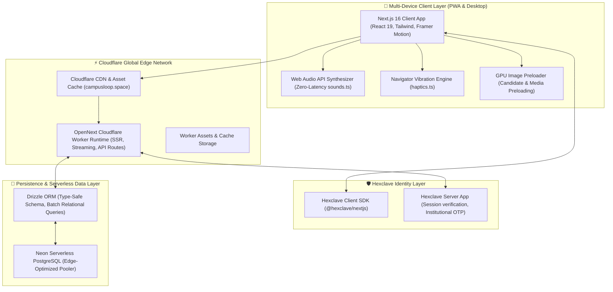
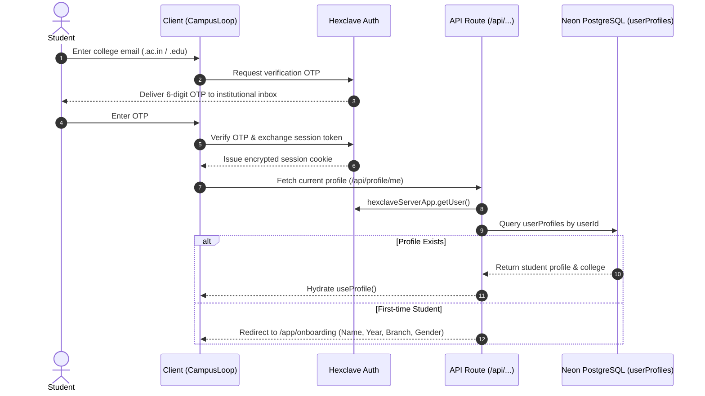
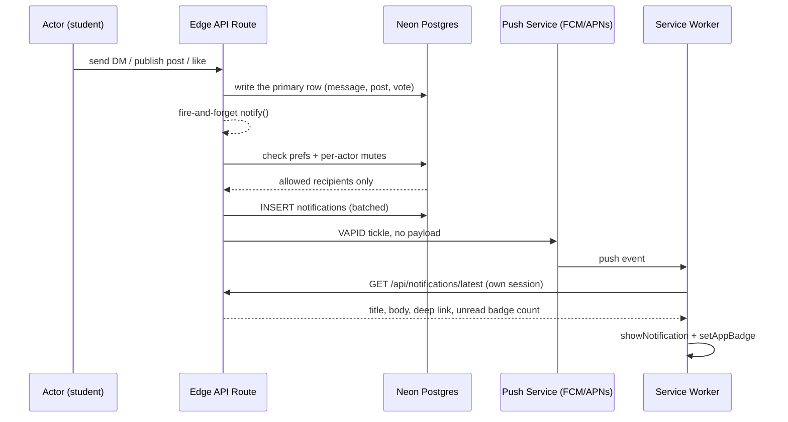

# 🏛️ CampusLoop Architecture & System Design

> **The verified student-only campus social network for 1,350+ Indian colleges.**  
> Built with Next.js 16 (App Router), OpenNext Cloudflare Workers, Neon Serverless PostgreSQL, Drizzle ORM, and Hexclave Auth.

---

## 📑 Table of Contents
1. [High-Level System Architecture](#1-high-level-system-architecture)
2. [Runtime & Edge Infrastructure](#2-runtime--edge-infrastructure)
3. [Identity & Authentication Subsystem](#3-identity--authentication-subsystem)
4. [Database Architecture & Schema Topology](#4-database-architecture--schema-topology)
5. [Core Feature Engines](#5-core-feature-engines)
   - [5.1 Feed & Ranking Engine](#51-feed--ranking-engine)
   - [5.2 Campus Match & Dating Engine](#52-campus-match--dating-engine)
   - [5.3 Stories & Ephemeral Vibes](#53-stories--ephemeral-vibes)
   - [5.4 Communities & Campus Utility Hubs](#54-communities--campus-utility-hubs)
   - [5.5 Chat & Instant Messaging](#55-chat--instant-messaging)
   - [5.6 Campus Time Capsule & Batch Legacy Vault](#56-campus-time-capsule--batch-legacy-vault)
   - [5.10 Notification & Push Delivery Engine](#510-notification--push-delivery-engine)
6. [Gamification & Loop Points (LP) Engine](#6-gamification--loop-points-lp-engine)
7. [Zero-Latency Audio & Physical Haptics Engine](#7-zero-latency-audio--physical-haptics-engine)
8. [Trust, Safety, Moderation & Legal Compliance](#8-trust-safety-moderation--legal-compliance)
9. [Frontend Design System & Component Guidelines](#9-frontend-design-system--component-guidelines)
10. [Build, Test & Deployment Workflow](#10-build-test--deployment-workflow)

---

## 1. High-Level System Architecture



---

## 2. Runtime & Edge Infrastructure

CampusLoop is designed for sub-50ms latency across India by running entirely on edge infrastructure:

- **Next.js 16 (App Router)**: Utilizing server components by default for zero client bundle bloat, delegating interactivity to optimized client components.
- **OpenNext for Cloudflare (`@opennextjs/cloudflare`)**: Converts the Next.js App Router build into a lightweight, high-throughput Cloudflare Worker bundle.
- **Wrangler Deployments**: Deployed with Cloudflare Workers triggers mapped to the custom domain `campusloop.space`.
- **Static Asset Caching**: Pre-rendered marketing pages, legal documents, SVGs, and web assets are served from Cloudflare edge caches worldwide.
- **Strict Server/Client Boundary Rules**:
  - `page.tsx` and `layout.tsx` files exporting `metadata` or `generateMetadata` **must never** use `"use client"`.
  - Interactive UI is separated into client components (e.g., `feed-client.tsx`, `dating-app-client.tsx`, `messenger-pane.tsx`).

---

## 3. Identity & Authentication Subsystem

Student authenticity is the primary network moat of CampusLoop:



### Key Components:
- **Server Session Verification**: Handled via `hexclaveServerApp.getUser()` in [`src/hexclave/server.ts`](campusloop/src/hexclave/server.ts).
- **Client Profile Hook**: [`src/hooks/use-profile.ts`](campusloop/src/hooks/use-profile.ts) powers client-side profile caching, verification status, and optimistic updates.
- **Campus Preview (Viewer Mode)**: Controlled via [`src/lib/viewer.ts`](campusloop/src/lib/viewer.ts) and gated through [`src/lib/capabilities.ts`](campusloop/src/lib/capabilities.ts), so every write API refuses a viewer through a single capability check rather than scattered role comparisons. A preview profile is an ordinary `user_profiles` row parked in a reserved "Viewer Hub" institution — no separate account type and no schema fork.
- **Campus upgrade path**: [`src/lib/campus-upgrade.ts`](campusloop/src/lib/campus-upgrade.ts) plus the two-step `POST /api/profile/upgrade-campus` and `.../confirm` endpoints. Step one attaches the college address to the auth account as an unverified, non-primary contact channel and emails a verification link; step two applies the upgrade only once the provider reports the channel verified. Eligibility is re-checked at both steps. The institution is derived from a whitelisted domain in `institution_domains` — never from a client-supplied id — and addresses already bound to another profile or auth account are refused. The upgrade happens **in place**: the college channel is promoted to primary and sign-in-capable while the personal address is retained as a secondary recovery channel, so the same profile row keeps every dependent record (posts, saved posts, follows, points).

---

## 4. Database Architecture & Schema Topology

The database is built on **Neon Serverless PostgreSQL** and managed through **Drizzle ORM**. The schema is split by domain across [`src/db/schema/`](campusloop/src/db/schema/) (26 modules — `posts`, `users`, `chat`, `notifications`, `dating`, `commercial-marketplace`, …), with every table and relation re-exported through [`src/db/schema.ts`](campusloop/src/db/schema.ts) so application code has one import site.

> **Schema changes reach the database through `bun run db:push`.** The generated `drizzle/` migration chain is stale — its newest snapshot predates most of the current schema, so `drizzle-kit generate` emits a full recreate of every table rather than a delta. Explicit, idempotent DDL for hand-applying against a production Neon branch lives in [`drizzle/manual/`](campusloop/drizzle/manual/).


---

## 5. Core Feature Engines

### 5.1 Feed & Ranking Engine
Located in [`src/lib/feed.ts`](campusloop/src/lib/feed.ts) and [`src/app/api/feed/route.ts`](campusloop/src/app/api/feed/route.ts):
- **Scope Modes**:
  - `CAMPUS`: Filtered strictly by `userProfiles.institutionId = profile.institutionId`.
  - `GLOBAL`: Surfaces posts across all 1,350+ Indian colleges.
- **Sorting Algorithms**:
  - `for_you`: Decaying time-weighted score + campus locality boost + engagement velocity + social affinity.
  - `latest`: Strictly chronological order (`createdAt DESC`) — deliberately **not** affinity-weighted, so "Latest" always means latest.
  - `trending`: HackerNews/Reddit gravity decay over recent votes and comments, scaled by social affinity.
  - `viral`: Multi-armed-bandit heavy ranker — velocity derivative + log-scaled engagement floor + stochastic exploration, scaled by social affinity.
  - `spicy`: Confession-weighted controversy and discussion velocity.
  - `top_voted`: Ranked by net upvotes (`upvotes - downvotes`).
  - `most_discussed`: Ranked by total comment count.
- **Social Affinity Weighting** (`followAffinityMultiplierSql`):
  - Posts by a **mutual friend** are multiplied by **1.75×**; posts by someone the viewer **follows one-way** by **1.4×**; everyone else by **1.0×**.
  - Expressed as a *multiplier*, not a flat bonus, so it composes with any ranking scale — the gravity-decayed trending score and the log-scaled viral score differ by an order of magnitude, and a constant tuned for one would either vanish or dominate in the other.
  - `for_you` additionally carries the older flat bonuses (+120 friend / +80 follow) alongside its campus-locality and seen-post terms.
  - Anonymous posts carry no `author_id`, so the affinity term can never boost — or deanonymize — a confession.
- **Cryptographic Anonymity**:
  - Pseudonymized handles generated via HMAC-SHA256 with institutional salt (`deriveAnonHandle`).
  - Strict isolation prevents moderators or users from linking anonymous confessions to real student profiles.

### 5.2 Campus Match & Dating Engine
Located in [`src/components/dating/swipe-deck.tsx`](campusloop/src/components/dating/swipe-deck.tsx) and [`src/app/api/dating/`](campusloop/src/app/api/dating/):
- **Fluid Gesture Mechanics**: Framer Motion draggable cards with velocity-based release detection (`offset.x > 80 || velocity.x > 400`).
- **Zero-Lag Image Preloading**: Background image preloader (`new Image().src = ...`) warms up the next 5 candidates in browser memory.
- **Respectable Unsplash Portrait Engine**: High-res, verified Unsplash college portraits in [`src/constants/dating-photos.ts`](campusloop/src/constants/dating-photos.ts) replacing cartoon/Dicebear avatars.
- **Circular PFP Indicator**: Circular avatar rendered directly before the student's name on full-screen cards.
- **Compatibility Scoring**: Multi-factor algorithm in [`src/lib/dating.ts`](campusloop/src/lib/dating.ts) evaluating shared interests, college proximity, and reciprocal likes.
- **Secret Crush Escrow**: Unilateral crushes remain 100% encrypted until a mutual crush occurs.

### 5.3 Stories & Ephemeral Vibes
Located in [`src/components/stories/`](campusloop/src/components/stories/) and [`src/app/api/stories/`](campusloop/src/app/api/stories/):
- **24-Hour Lifetime**: Ephemeral media content automatically expires after 24 hours.
- **Interactive Story Viewer**: Fullscreen progressive timer bars, touch tap navigation, story heart likes, and smart pause-on-reply typing.
- **Story Archive & Highlights**: Permanent storage for expired stories allowing students to curate personal profile highlights.

### 5.4 Communities & Campus Utility Hubs
Located in [`src/components/communities/`](campusloop/src/components/communities/):
- **Reddit-Style Sub-Hubs**: Student interest communities (`c/coding`, `c/music-band`, `c/anime`) with full sorting (`Hot`, `New`, `Top`, `Rising`, `Discussed`).
- **6 Dedicated Template Portals**:
  1. `/app/lost-and-found` — Lost item retrieval & instant claim messaging.
  2. `/app/marketplace` (and `/app/buy-and-sell`) — Peer-to-peer hostel trading.
  3. `/app/gaming` (and `/app/gaming-arena`) — Squad recruitment and LAN tournament lobbies.
  4. `/app/rideshare` (and `/app/ride-share`) — Weekend auto & cab pooling.
  5. `/app/housing` (and `/app/housing-and-flats`) — Roommate matching & flat hunting.
  6. `/app/academics` — End-sem handwritten notes, PYQ sheets, and course reviews.

### 5.5 Chat & Instant Messaging
Located in [`src/components/chat/`](campusloop/src/components/chat/) and [`src/app/api/chat/`](campusloop/src/app/api/chat/):
- **Auto-Resizing Composer**: Multi-line auto-expanding textarea supporting native clipboard & keyboard sticker paste (Gboard & iOS Memojis).
- **Safe-Area Alignment**: Native touch padding with `pb-[max(0.75rem,env(safe-area-inset-bottom))]`.
- **Skeleton Loaders**: Dedicated instant loading states preventing blank screens during thread transitions.

### 5.6 1-to-1 Audio & Video Calling (PeerJS & WebRTC)
Located in [`src/components/calls/`](campusloop/src/components/calls/), [`src/lib/calls/`](campusloop/src/lib/calls/), and [`src/app/api/calls/`](campusloop/src/app/api/calls/):
- **Decoupled Control & Media Planes**: Control plane runs on Cloudflare Workers, Upstash Redis (sub-5ms signaling) and Neon PostgreSQL (`call_sessions` table). Media plane runs directly P2P between browsers via WebRTC (`peerjs`).
- **Zero Media Relaying on Workers**: Audio (Opus) and video (VP8/H.264) never route through or cost worker bandwidth.
- **Resilient Fallback**: Automatic camera permission degradation with seamless audio-only fallback without dropping calls.
- **Mobile Camera Flipping**: Front/rear camera toggling with direct WebRTC video sender track replacement.

### 5.7 Random Loop Video & Accountable Anonymity
Located in [`src/components/random/`](campusloop/src/components/random/) and [`src/app/api/random/`](campusloop/src/app/api/random/):
- **Opt-In Video Handshake**: Starts as a protected text chat; video initiates **only** upon mutual consent (`userAVideoRequested && userBVideoRequested`).
- **Mutual Identity Reveal**: Identities remain shielded as "Anonymous Student" until both users explicitly tap **Reveal Me**.
- **Instant Next Person**: Hardware camera and mic tracks are cleanly killed and connections destroyed immediately upon skipping.

### 5.8 User Behavior Analytics & Collaborative Personalization
Located in [`src/lib/user-behavior.ts`](campusloop/src/lib/user-behavior.ts) and [`src/app/api/behavior/`](campusloop/src/app/api/behavior/):
- **Dual-Layer Ingestion**: Ultra-fast writes to Upstash Redis sorted sets (`user:<id>:recents:<type>` & `user:<id>:interests`) coupled with durable audit rows in `user_behavior_events`.
- **Real-Time Feed & Discover Boosting**: Dynamic weighting of user dwell time, clicks, search queries, and friend interactions to supercharge For You feed recommendations.

### 5.9 Campus Time Capsule & Batch Legacy Vault
Located in [`src/components/landing/time-capsule-showcase.tsx`](campusloop/src/components/landing/time-capsule-showcase.tsx) and [`src/app/app/(main)/capsule/`](campusloop/src/app/app/(main)/capsule/):
- **Cryptographic Batch Lock**: Sealed letters, predictions, and confessions locked until graduation day.
- **Live Countdown Timer**: Real-time ticker counting down days, hours, and minutes to convocation.
- **Unlocked Museum Wall**: Public batch archive rendered after timer expiry.

### 5.10 Notification & Push Delivery Engine
Located in [`src/lib/notifications.ts`](campusloop/src/lib/notifications.ts), [`src/lib/notification-preferences.ts`](campusloop/src/lib/notification-preferences.ts), [`src/lib/web-push.ts`](campusloop/src/lib/web-push.ts) and [`src/app/api/notifications/`](campusloop/src/app/api/notifications/):

**Payload-free push ("tickles").** Pushes are VAPID-authenticated wake-ups carrying *no* encrypted body. The service worker ([`public/sw.js`](campusloop/public/sw.js)) wakes, calls `/api/notifications/latest` over the student's **own session**, and renders from that. Notification content therefore never passes through Google's, Apple's or Mozilla's push infrastructure — and there is no hand-rolled RFC 8291 payload encryption to get wrong. `src/lib/web-push.ts` signs the VAPID JWT with Web Crypto, so it runs on workerd where the Node-`crypto`-based `web-push` package cannot.



**Notification types.** `LIKE`, `COMMENT`, `REPLY`, `MENTION`, `REPOST`, `MATCH`, `CRUSH_ALERT`, `MILESTONE`, `FOLLOW`, `FRIEND`, `STORY_LIKE`, `STORY_REPLY`, `MESSAGE`, `NEW_POST`. `MATCH` and `MESSAGE` are sent at `high` urgency; the rest ride normal urgency.

**Two silencers, deliberately separate:**

| | Scope | Storage | Where the student sets it |
| :--- | :--- | :--- | :--- |
| **Preference** | A whole category — "never ping me about likes" | `notification_preferences` (one row per student, all-on default) | Settings → Platform Preferences |
| **Mute** | One person, one channel — "his posts, not his DMs" | `notification_mutes` `(user_id, muted_user_id, channel)` | The bell on that person's profile |

`channel` is one of `POST`, `MESSAGE`, `LIKE`, `COMMENT`, `MENTION`, `REPOST`, `FOLLOW`, `STORY`, `MATCH`, or the wildcard `ALL`. Absence of a row means *notify* — a mute is an explicit opt-out, which keeps the hot path a single indexed lookup and makes the default correct for a student who never opens settings.

**Muting is notification-only.** A muted person keeps their place in the feed and keeps the follow-affinity ranking boost, and is never told. Silencing an alert is not unfollowing, and conflating the two is how students end up quietly cut off from their own campus.

**Fan-out economics.** `createNotificationsForMany` is deliberately not a loop over `createNotification`: the mute/preference filter is batched into two `IN` queries and the rows land in one multi-value insert, so a post reaching a thousand followers costs a bounded number of round trips rather than a thousand. Pushes go out in waves of 25 so one worker invocation never opens hundreds of simultaneous sockets, and the audience is capped at **500** recipients — mutual friends are ordered first, so when a popular account exceeds the cap the people who lose the push are one-way followers, not actual friends.

**Message notifications** ([`src/lib/chat-notifications.ts`](campusloop/src/lib/chat-notifications.ts)) additionally respect the per-conversation `conversation_participants.is_muted` flag, and **collapse**: any still-unread `MESSAGE` row for the same thread is cleared before the newest one is written, so a rapid back-and-forth leaves one entry per conversation instead of a wall. Read rows are left alone — they are history, not a backlog.

**Followed-post notifications** ([`src/lib/post-notifications.ts`](campusloop/src/lib/post-notifications.ts)) are the one place anonymity and notifications collide. **Anonymous posts never fan out.** A confession carries no author id and must not carry an actor id either — a "your friend just posted" ping sitting beside an anonymous post would deanonymize it by correlation. The guard lives inside the helper rather than at the call site, so it cannot be forgotten.

**Failure posture.** Every notification path is fire-and-forget and swallows its own errors: a failed push must never fail the message, post or like that triggered it. The preference/mute lookups **fail open** — if the check itself errors the notification is still delivered, on the grounds that a dropped alert is worse than an extra one.

### 5.7 Semantic Vector Search & Qdrant Cloud Engine
Located in [`src/lib/qdrant/`](campusloop/src/lib/qdrant/) and [`src/lib/recommendations/`](campusloop/src/lib/recommendations/):
- **Zero-Downtime Dual Layer**: Qdrant Cloud Vector Database acts strictly as an asynchronous enhancement layer.
- **Circuit Breaker & Strict Timeout**: Every Qdrant call is wrapped in a 600ms strict timeout and failure circuit breaker. If Qdrant is unavailable, the application automatically falls back 100% to PostgreSQL relational queries with zero latency penalty or downtime for users.
- **384-Dim Dense Embeddings**: Zero-dependency serverless vector generator ([`src/lib/qdrant/embeddings.ts`](campusloop/src/lib/qdrant/embeddings.ts)) producing L2-normalized vectors for Cosine similarity.
- **Related Campus Threads**: Related discussions widget on `/app/post/[id]` rendering semantic thread recommendations with similarity vibe score badges.
- **Non-Blocking Background Indexing**: Asynchronously indexes newly created posts and student profiles without delaying API responses.

---

## 6. Gamification & Loop Points (LP) Engine

Engine defined in [`src/lib/feed.ts`](campusloop/src/lib/feed.ts) and [`src/lib/gamification.ts`](campusloop/src/lib/gamification.ts):

| Action | Loop Points (LP) Reward |
| :--- | :--- |
| Verified Student Referral | **+20 LP** |
| Post Created | **+5 LP** |
| Helpful Comment / Reply | **+2 LP** |
| Poll Vote / Post Upvote | **+1 LP** |

### Clout Tiers:
- **Bronze Rookie**: 0 – 49 LP
- **Silver Achiever**: 50 – 149 LP
- **Gold Star (Verified Blue Badge ⚡)**: 150 – 299 LP (Automatic blue tick unlock)
- **Platinum Legend**: 300+ LP

---

## 7. Zero-Latency Audio & Physical Haptics Engine

CampusLoop includes an in-browser sensory feedback engine designed for native app feel without loading external MP3 files:

- **Synthesized Web Audio (`src/lib/sounds.ts`)**:
  - `sounds.pop()`: Crisp dual-frequency sine pop for Likes and Heart reactions.
  - `sounds.ting()`: Dual-tone crystalline chime (1760 Hz & 2637 Hz) for Reposts and Publishing.
  - `sounds.tap()`: Subtle tactile audio tick for navigation tabs and pills.
  - `sounds.archive()`: Metallic latch sound for sealing time capsules.
- **Physical Haptics (`src/lib/haptics.ts`)**:
  - `haptics.light()`: 10ms micro-pulse for tab clicks.
  - `haptics.impact()`: 25ms firm buzz for upvotes and likes.
  - `haptics.celebration()`: Dual-cadence burst `[20ms, 40ms, 20ms]` for mutual matches and reposts.

---

## 8. Trust, Safety, Moderation & Legal Compliance

Located in [`src/lib/moderation/`](campusloop/src/lib/moderation/) and policy routes:

- **Automated Doxxing & Abuse Filter**: Intercepts phone numbers, roll numbers, hostel room numbers, and abuse keywords before database write.
- **3-Strike Quarantine Escrow**: Any post receiving 3 independent reports is immediately hidden from campus feeds and queued in the `/admin` moderation desk.
- **Statutory Legal Compliance (India)**:
  - **Information Technology Act, 2000** & **IT Intermediary Rules, 2021**: Dedicated Grievance Redressal Officer with 24hr acknowledgement and 15-day resolution SLA.
  - **UGC Anti-Ragging Regulations, 2009**: Zero-tolerance digital hazing policy with direct escalation pathways.
  - **DPDP Act, 2023 (Digital Personal Data Protection)**: Full user data export and deletion rights.
- **Document Design System**: Monochrome document layouts in [`src/components/marketing/legal-doc.tsx`](campusloop/src/components/marketing/legal-doc.tsx) powering `/privacy`, `/terms`, `/safety`, and `/contact`.

---

## 9. Frontend Design System & Component Guidelines

1. **Monochrome Document Architecture**:
   - Legal, marketing, and institutional pages use high-contrast black/white typography with subtle `border-border/50` hairline rules.
2. **Twitter/X-Style Minimal Navigation**:
   - Fixed left sidebar on desktop (`w-64 border-r border-border/30`).
   - Clean mobile drawer and bottom navigation bar (`h-14 backdrop-blur-2xl`).
3. **Card & Interactive Overlays**:
   - Glassmorphic backdrops (`backdrop-blur-xl bg-background/85`).
   - Consistent rounded corners (`rounded-2xl` to `rounded-3xl`).
   - Strictly no excessive neon gradients or jarring colors.
4. **Mobile Responsiveness**:
   - All flex/grid containers enforce `min-w-0` to avoid horizontal overflow.
   - Root page wrappers enforce `overflow-x-clip`.

---

## 10. Build, Test & Deployment Workflow

### Essential Commands:
```bash
# 1. Type check (Strict: 0 errors allowed)
bunx tsc --noEmit

# 2. Lint & format
bunx biome check --write ./src

# 3. Run unit test suite (110 tests across 19 files)
bun run test

# 4. Push schema changes to Neon (NOT drizzle-kit generate — see §4)
bun run db:push

# 5. Development server
bun run dev

# 6. Deploy to Cloudflare Workers Edge
bun run deploy
```

### Build Memory Budget

The production build compiles ~700 source files and ~115k lines through webpack.
On a 16 GB machine this is unremarkable; on **8 GB it used to be SIGKILLed by the
macOS memory manager** partway through `Creating an optimized production build`,
surfacing as an opaque `signal: 'SIGKILL'` from OpenNext rather than an
out-of-memory message.

Four settings hold peak resident memory down — three in
[`next.config.ts`](campusloop/next.config.ts), one in the build script:

| Setting | What it does |
| :--- | :--- |
| `experimental.webpackMemoryOptimizations` | Frees webpack's cached module sources between compilations |
| `experimental.webpackBuildWorker` | Runs each compilation in its own short-lived worker, so its heap is reclaimed on exit |
| `experimental.memoryBasedWorkersCount` | Sizes the static-generation worker pool from *free memory* rather than CPU count |
| `NODE_OPTIONS='--max-old-space-size=5120'` | Raises the V8 heap ceiling from the 2.2 GB default without inviting an OS-level kill |

**Operational note**: a `next dev` server left running in another project holds
~700 MB–1 GB. On an 8 GB machine, stop other dev servers before building — the
config above buys headroom, it does not create RAM.

The build is expected to log `Error resolving merchant session: … couldn't be
rendered statically because it used cookies` for the `/merchant-portal/*` routes.
These are Next.js marking those routes dynamic, not failures, and the build exits 0.

### Git & Deployment Policy:
- Every step is committed atomically with conventional commit prefixes (`feat:`, `fix:`, `refactor:`).
- Final state is deployed live to Cloudflare Workers and pushed to GitHub `main`.
