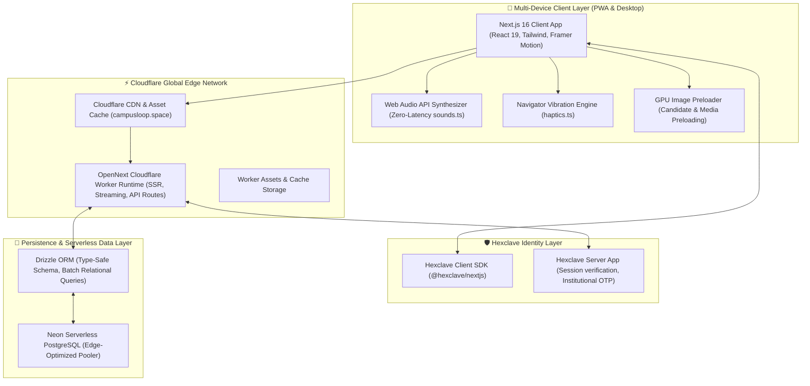
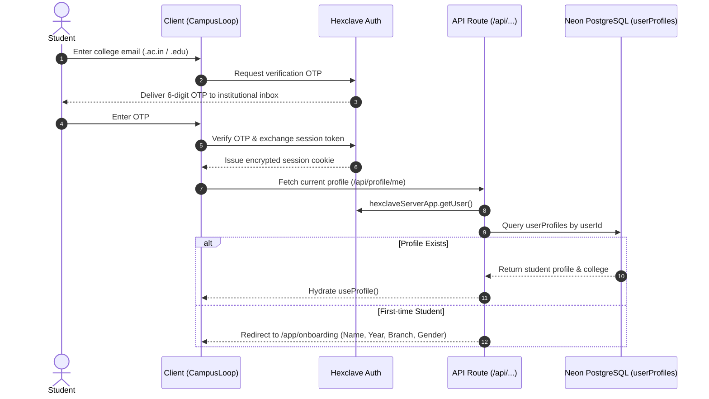
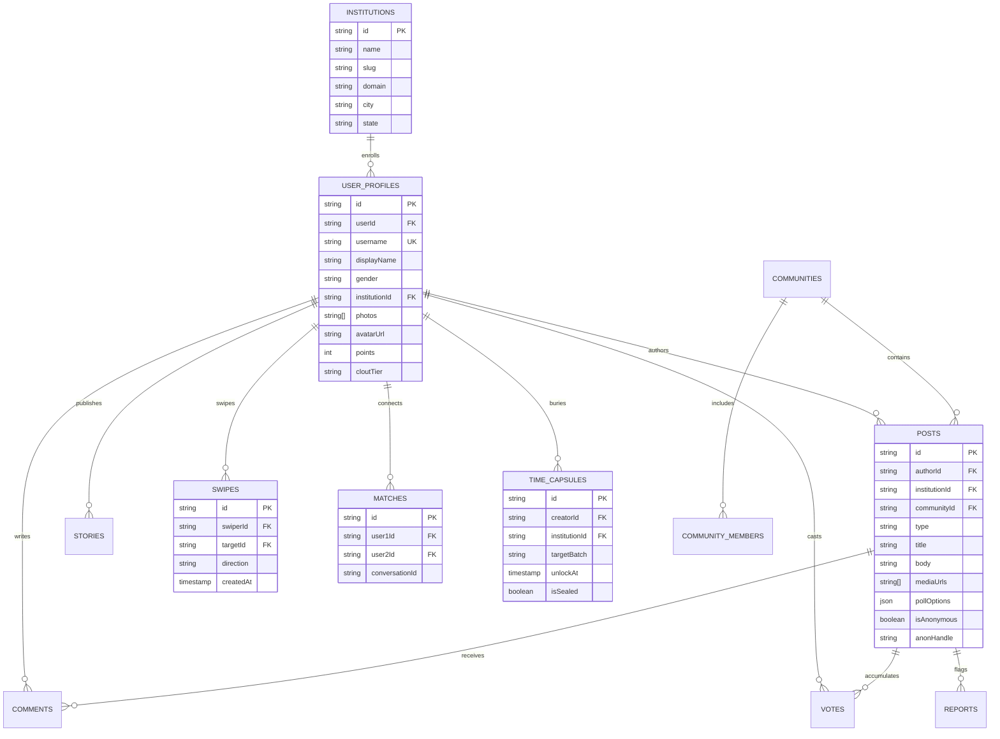

# 🏛️ CampusLoop Architecture & System Design

> **The verified student-only campus social network for 1,350+ Indian colleges.**  
> Built with Next.js 16 (App Router), OpenNext Cloudflare Workers, Neon Serverless PostgreSQL, Drizzle ORM, and Hexclave Auth.

---

## 📑 Table of Contents
1. [High-Level System Architecture](#1-high-level-system-architecture)
2. [Runtime & Edge Infrastructure](#2-runtime--edge-infrastructure)
3. [Identity & Authentication Subsystem](#3-identity--authentication-subsystem)
4. [Database Architecture & Schema Topology](#4-database-architecture--schema-topology)
5. [Core Feature Engines](#5-core-feature-engines)
   - [5.1 Feed & Ranking Engine](#51-feed--ranking-engine)
   - [5.2 Campus Match & Dating Engine](#52-campus-match--dating-engine)
   - [5.3 Stories & Ephemeral Vibes](#53-stories--ephemeral-vibes)
   - [5.4 Communities & Campus Utility Hubs](#54-communities--campus-utility-hubs)
   - [5.5 Chat & Instant Messaging](#55-chat--instant-messaging)
   - [5.6 Campus Time Capsule & Batch Legacy Vault](#56-campus-time-capsule--batch-legacy-vault)
6. [Gamification & Loop Points (LP) Engine](#6-gamification--loop-points-lp-engine)
7. [Zero-Latency Audio & Physical Haptics Engine](#7-zero-latency-audio--physical-haptics-engine)
8. [Trust, Safety, Moderation & Legal Compliance](#8-trust-safety-moderation--legal-compliance)
9. [Frontend Design System & Component Guidelines](#9-frontend-design-system--component-guidelines)
10. [Build, Test & Deployment Workflow](#10-build-test--deployment-workflow)

---

## 1. High-Level System Architecture



---

## 2. Runtime & Edge Infrastructure

CampusLoop is designed for sub-50ms latency across India by running entirely on edge infrastructure:

- **Next.js 16 (App Router)**: Utilizing server components by default for zero client bundle bloat, delegating interactivity to optimized client components.
- **OpenNext for Cloudflare (`@opennextjs/cloudflare`)**: Converts the Next.js App Router build into a lightweight, high-throughput Cloudflare Worker bundle.
- **Wrangler Deployments**: Deployed with Cloudflare Workers triggers mapped to the custom domain `campusloop.space`.
- **Static Asset Caching**: Pre-rendered marketing pages, legal documents, SVGs, and web assets are served from Cloudflare edge caches worldwide.
- **Strict Server/Client Boundary Rules**:
  - `page.tsx` and `layout.tsx` files exporting `metadata` or `generateMetadata` **must never** use `"use client"`.
  - Interactive UI is separated into client components (e.g., `feed-client.tsx`, `dating-app-client.tsx`, `messenger-pane.tsx`).

---

## 3. Identity & Authentication Subsystem

Student authenticity is the primary network moat of CampusLoop:



### Key Components:
- **Server Session Verification**: Handled via `hexclaveServerApp.getUser()` in [`src/hexclave/server.ts`](campusloop/src/hexclave/server.ts).
- **Client Profile Hook**: [`src/hooks/use-profile.ts`](campusloop/src/hooks/use-profile.ts) powers client-side profile caching, verification status, and optimistic updates.
- **Viewer / Unverified Mode**: Controlled via [`src/lib/viewer.ts`](campusloop/src/lib/viewer.ts), allowing prospective students to explore public campus directory data while preventing writes or private messaging.

---

## 4. Database Architecture & Schema Topology

The database is built on **Neon Serverless PostgreSQL** and managed through **Drizzle ORM** in [`src/db/schema.ts`](campusloop/src/db/schema.ts).



---

## 5. Core Feature Engines

### 5.1 Feed & Ranking Engine
Located in [`src/lib/feed.ts`](campusloop/src/lib/feed.ts) and [`src/app/api/feed/route.ts`](campusloop/src/app/api/feed/route.ts):
- **Scope Modes**:
  - `CAMPUS`: Filtered strictly by `userProfiles.institutionId = profile.institutionId`.
  - `GLOBAL`: Surfaces posts across all 1,350+ Indian colleges.
- **Sorting Algorithms**:
  - `for_you`: Decaying time-weighted score + campus locality boost + engagement velocity.
  - `latest`: Strictly chronological order (`createdAt DESC`).
  - `trending`: Weighted by comment interaction volume, reposts, and active participant velocity.
  - `top_voted`: Ranked by net upvotes (`upvotes - downvotes`).
  - `discussed`: Ranked by total comment count.
- **Cryptographic Anonymity**:
  - Pseudonymized handles generated via HMAC-SHA256 with institutional salt (`deriveAnonHandle`).
  - Strict isolation prevents moderators or users from linking anonymous confessions to real student profiles.

### 5.2 Campus Match & Dating Engine
Located in [`src/components/dating/swipe-deck.tsx`](campusloop/src/components/dating/swipe-deck.tsx) and [`src/app/api/dating/`](campusloop/src/app/api/dating/):
- **Fluid Gesture Mechanics**: Framer Motion draggable cards with velocity-based release detection (`offset.x > 80 || velocity.x > 400`).
- **Zero-Lag Image Preloading**: Background image preloader (`new Image().src = ...`) warms up the next 5 candidates in browser memory.
- **Respectable Unsplash Portrait Engine**: High-res, verified Unsplash college portraits in [`src/constants/dating-photos.ts`](campusloop/src/constants/dating-photos.ts) replacing cartoon/Dicebear avatars.
- **Circular PFP Indicator**: Circular avatar rendered directly before the student's name on full-screen cards.
- **Compatibility Scoring**: Multi-factor algorithm in [`src/lib/dating.ts`](campusloop/src/lib/dating.ts) evaluating shared interests, college proximity, and reciprocal likes.
- **Secret Crush Escrow**: Unilateral crushes remain 100% encrypted until a mutual crush occurs.

### 5.3 Stories & Ephemeral Vibes
Located in [`src/components/stories/`](campusloop/src/components/stories/) and [`src/app/api/stories/`](campusloop/src/app/api/stories/):
- **24-Hour Lifetime**: Ephemeral media content automatically expires after 24 hours.
- **Interactive Story Viewer**: Fullscreen progressive timer bars, touch tap navigation, story heart likes, and smart pause-on-reply typing.
- **Story Archive & Highlights**: Permanent storage for expired stories allowing students to curate personal profile highlights.

### 5.4 Communities & Campus Utility Hubs
Located in [`src/components/communities/`](campusloop/src/components/communities/):
- **Reddit-Style Sub-Hubs**: Student interest communities (`c/coding`, `c/music-band`, `c/anime`) with full sorting (`Hot`, `New`, `Top`, `Rising`, `Discussed`).
- **6 Dedicated Template Portals**:
  1. `/app/lost-and-found` — Lost item retrieval & instant claim messaging.
  2. `/app/marketplace` (and `/app/buy-and-sell`) — Peer-to-peer hostel trading.
  3. `/app/gaming` (and `/app/gaming-arena`) — Squad recruitment and LAN tournament lobbies.
  4. `/app/rideshare` (and `/app/ride-share`) — Weekend auto & cab pooling.
  5. `/app/housing` (and `/app/housing-and-flats`) — Roommate matching & flat hunting.
  6. `/app/academics` — End-sem handwritten notes, PYQ sheets, and course reviews.

### 5.5 Chat & Instant Messaging
Located in [`src/components/chat/`](campusloop/src/components/chat/) and [`src/app/api/chat/`](campusloop/src/app/api/chat/):
- **Auto-Resizing Composer**: Multi-line auto-expanding textarea supporting native clipboard & keyboard sticker paste (Gboard & iOS Memojis).
- **Safe-Area Alignment**: Native touch padding with `pb-[max(0.75rem,env(safe-area-inset-bottom))]`.
- **Skeleton Loaders**: Dedicated instant loading states preventing blank screens during thread transitions.

### 5.6 Campus Time Capsule & Batch Legacy Vault
Located in [`src/components/landing/time-capsule-showcase.tsx`](campusloop/src/components/landing/time-capsule-showcase.tsx) and [`src/app/app/(main)/capsule/`](campusloop/src/app/app/(main)/capsule/):
- **Cryptographic Batch Lock**: Sealed letters, predictions, and confessions locked until graduation day.
- **Live Countdown Timer**: Real-time ticker counting down days, hours, and minutes to convocation.
- **Unlocked Museum Wall**: Public batch archive rendered after timer expiry.

---

## 6. Gamification & Loop Points (LP) Engine

Engine defined in [`src/lib/feed.ts`](campusloop/src/lib/feed.ts) and [`src/lib/gamification.ts`](campusloop/src/lib/gamification.ts):

| Action | Loop Points (LP) Reward |
| :--- | :--- |
| Verified Student Referral | **+20 LP** |
| Post Created | **+5 LP** |
| Helpful Comment / Reply | **+2 LP** |
| Poll Vote / Post Upvote | **+1 LP** |

### Clout Tiers:
- **Bronze Rookie**: 0 – 49 LP
- **Silver Achiever**: 50 – 149 LP
- **Gold Star (Verified Blue Badge ⚡)**: 150 – 299 LP (Automatic blue tick unlock)
- **Platinum Legend**: 300+ LP

---

## 7. Zero-Latency Audio & Physical Haptics Engine

CampusLoop includes an in-browser sensory feedback engine designed for native app feel without loading external MP3 files:

- **Synthesized Web Audio (`src/lib/sounds.ts`)**:
  - `sounds.pop()`: Crisp dual-frequency sine pop for Likes and Heart reactions.
  - `sounds.ting()`: Dual-tone crystalline chime (1760 Hz & 2637 Hz) for Reposts and Publishing.
  - `sounds.tap()`: Subtle tactile audio tick for navigation tabs and pills.
  - `sounds.archive()`: Metallic latch sound for sealing time capsules.
- **Physical Haptics (`src/lib/haptics.ts`)**:
  - `haptics.light()`: 10ms micro-pulse for tab clicks.
  - `haptics.impact()`: 25ms firm buzz for upvotes and likes.
  - `haptics.celebration()`: Dual-cadence burst `[20ms, 40ms, 20ms]` for mutual matches and reposts.

---

## 8. Trust, Safety, Moderation & Legal Compliance

Located in [`src/lib/moderation/`](campusloop/src/lib/moderation/) and policy routes:

- **Automated Doxxing & Abuse Filter**: Intercepts phone numbers, roll numbers, hostel room numbers, and abuse keywords before database write.
- **3-Strike Quarantine Escrow**: Any post receiving 3 independent reports is immediately hidden from campus feeds and queued in the `/admin` moderation desk.
- **Statutory Legal Compliance (India)**:
  - **Information Technology Act, 2000** & **IT Intermediary Rules, 2021**: Dedicated Grievance Redressal Officer with 24hr acknowledgement and 15-day resolution SLA.
  - **UGC Anti-Ragging Regulations, 2009**: Zero-tolerance digital hazing policy with direct escalation pathways.
  - **DPDP Act, 2023 (Digital Personal Data Protection)**: Full user data export and deletion rights.
- **Document Design System**: Monochrome document layouts in [`src/components/marketing/legal-doc.tsx`](campusloop/src/components/marketing/legal-doc.tsx) powering `/privacy`, `/terms`, `/safety`, and `/contact`.

---

## 9. Frontend Design System & Component Guidelines

1. **Monochrome Document Architecture**:
   - Legal, marketing, and institutional pages use high-contrast black/white typography with subtle `border-border/50` hairline rules.
2. **Twitter/X-Style Minimal Navigation**:
   - Fixed left sidebar on desktop (`w-64 border-r border-border/30`).
   - Clean mobile drawer and bottom navigation bar (`h-14 backdrop-blur-2xl`).
3. **Card & Interactive Overlays**:
   - Glassmorphic backdrops (`backdrop-blur-xl bg-background/85`).
   - Consistent rounded corners (`rounded-2xl` to `rounded-3xl`).
   - Strictly no excessive neon gradients or jarring colors.
4. **Mobile Responsiveness**:
   - All flex/grid containers enforce `min-w-0` to avoid horizontal overflow.
   - Root page wrappers enforce `overflow-x-clip`.

---

## 10. Build, Test & Deployment Workflow

### Essential Commands:
```bash
# 1. Type check (Strict: 0 errors allowed)
bunx tsc --noEmit

# 2. Run unit test suite (56+ tests)
bun test

# 3. Development server
bun run dev

# 4. Deploy to Cloudflare Workers Edge
bun run deploy
```

### Git & Deployment Policy:
- Every step is committed atomically with conventional commit prefixes (`feat:`, `fix:`, `refactor:`).
- Final state is deployed live to Cloudflare Workers and pushed to GitHub `main`.
