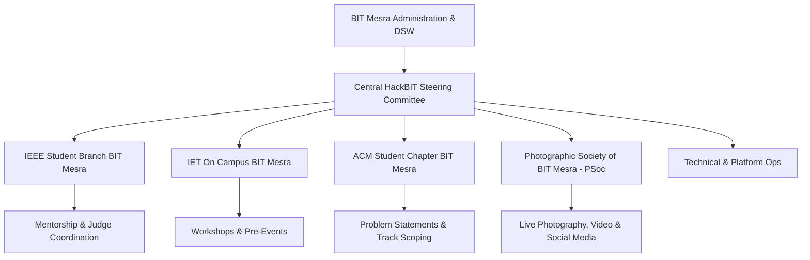

# ⚡ Comprehensive Proposal & Institutional Dossier: HackBIT (Hack-A-BIT)
### *East India's Premier Student Hackathon — Birla Institute of Technology (BIT), Mesra*

---

## 📌 Executive Summary

**HackBIT** (officially organized and branded as **Hack-A-BIT** / **HACK-A-BIT**) is the flagship national-level annual hackathon organized by the student technical community at the **Birla Institute of Technology (BIT), Mesra, Ranchi**. Conceived in 2018, it quickly evolved into **East India’s largest student-run hackathon**, drawing thousands of applicants from premier universities across India (including IITs, NITs, and central universities).

Operating under the founding ethos **"Build – Innovate – Triumph" (B.I.T.)**, the hackathon provides a high-octane 36-hour offline sprint where shortlisted student developers, designers, and hardware engineers build cutting-edge solutions across Artificial Intelligence, Web3/Blockchain, IoT, Cloud Infrastructure, and Social Impact.

This document serves as an exhaustive institutional proposal and reference dossier—synthesizing past editions, structural mechanics, judging frameworks, budget and sponsorship models, and an extensive archival record of social media campaigns, Facebook posts, photo albums, captions, and participant experiences.

---

## 🏛️ Event Genesis & Heritage

| Attribute | Details |
| :--- | :--- |
| **Official Name** | **Hack-A-BIT** (colloquially and in collegiate shorthand: **HackBIT** / **HackABIT**) |
| **Founding Year** | 2018 (Inaugural Edition: October 26–28, 2018) |
| **Host Institution** | Birla Institute of Technology, Mesra, Ranchi, Jharkhand – 835215 |
| **Core Motto** | **Build · Innovate · Triumph** (Forming the acronym **B-I-T**) |
| **Official Mascot** | **Ada** — a friendly and witty hyena named in homage to **Countess Ada Lovelace**, recognized as the world’s first computer programmer |
| **Official Web Domain** | `www.hackabit.in` / `hackabit.com` |
| **Primary Social Media** | [facebook.com/hackabit](https://www.facebook.com/hackabit) · [github.com/hackabit-bitm](https://github.com/hackabit-bitm) |
| **Scale Recognition** | Recognized across student circuits and industry partners as *East India's Largest Student Hackathon* |

### Origin Narrative
The hackathon was conceived in 2018 by final-year engineering students who observed that while Western and Southern India had established hackathon circuits, Eastern India lacked a premier, pan-India student hackathon with elite judging, direct venture/corporate bounties, and tier-1 amenities. Combining forces across the university's premier technical societies, the students engineered the first edition with zero registration fees, complimentary on-campus accommodation, and travel assistance for top teams.

---

## 🤝 Organizing Bodies & Stakeholders

Hack-A-BIT is engineered collaboratively by the prominent student technical societies at BIT Mesra, operating under institutional patronage:



1. **IEEE Student Branch, BIT Mesra**:
   - Anchors logistics, university liaison, institutional accreditation, and international mentor outreach.
2. **IET On Campus, BIT Mesra**:
   - Leads workshop tracks (Linux, Git/GitHub, Python, Web Dev), participant onboarding, and developer engagement.
3. **ACM (Association for Computing Machinery) Student Chapter, BIT Mesra**:
   - Oversees problem statement formulation, code integrity, plagiarism audits, and judging rubrics.
4. **Photographic Society of BIT Mesra (PSoc)**:
   - Official visual media partner responsible for capturing high-resolution photography, aftermovies, winner moments, and the official Facebook/Instagram albums.
5. **Institutional Patronage**:
   - **Office of the Dean of Student's Welfare (DSW)**: Prof. Anand Kumar Sinha (and successors).
   - **Faculty Advisors**: Dr. D.K. Upadhyay and senior Department of Computer Science & Engineering (CSE) professors.

---

## 📈 Past Editions Track Record & Milestones

### 1. Hack-A-BIT 1.0 (October 26–28, 2018)
* **Theme**: Open Innovation & Hardware-Software Synthesis.
* **Reach**: 300+ project proposals received; **54 teams (200+ hackers)** shortlisted for the on-campus round.
* **Duration**: 36 hours continuous on-site hacking.
* **Title Sponsor**: **ITH Technologies (Infotech Hub Technologies)**.
* **Judges**: Mr. Pratyush Agarwal (Co-founder of CodeAsylums, BIT Mesra alumnus) alongside prominent engineering leaders.
* **Top Winners**:
  - 🥇 **Champion**: Team Whack (*Bharati Vidyapeeth’s College of Engineering, New Delhi*)
  - 🥈 **1st Runner-Up**: Team Arcade (*BIT Mesra*)
  - 🥉 **2nd Runner-Up**: Team Kubs (*IIT Kharagpur*)
* **Featured Projects**: Augmented Reality physical therapy systems, decentralized student credentialing, automated agricultural monitoring.

### 2. Hack-A-BIT 2.0 (October 18–20, 2019)
* **Scale**: Exponential expansion to **1,700+ student registrations** across 150+ universities in India.
* **Finalists**: **52 elite teams** invited to the physical campus after rigorous online proposal screening.
* **Prize Pool**: **₹3,00,000+ total rewards** with **₹1,10,000+ in pure cash prizes** (₹40,000 Winner, ₹30,000 1st Runner Up, ₹20,000 2nd Runner Up, plus specific sponsor bounties).
* **High-Profile Judges & Keynote Speakers**:
  - **Mr. Kaustubh Karkare**: Senior Software Engineer & Tech Lead at **Facebook Inc. (Menlo Park, CA)**, BIT Mesra ECE alumnus.
  - **Ms. Ramya Authappan**: Engineering Manager (Quality) at **GitLab Inc.**, Director of **Women Who Code Chennai**, ex-Amazon, PayPal, Juniper Networks.
* **Corporate Challenge Winners**:
  - **Matic Network (Polygon) Challenge**: *Team Falcons* for *"Distributed EC2 over Blockchain"* (decentralized cloud compute on Ethereum/Matic).
  - **ZEIT (Vercel) Deployment Challenge**: *Team India’s Best Chance* for instant global microservice deployment using ZEIT Now.
  - **Ably Realtime Challenge**: Real-time collaborative telemetry system.

### 3. Recent Revivals & Hack-A-BIT 2024
* **Date**: March 2, 2024 (24-hour sprint).
* **Platform**: Unstop & GitHub.
* **Focus Theme**: **"Aatmanirbhar Bharat"** (Tech self-reliance in aerospace, enterprise SaaS, health diagnostics, and smart cities).

---

## 🎯 Proposed Event Architecture (HackBIT 2026 / 2027)

### Format & Phases
```
Phase 1: National Call & Online Idea Submission (45 Days)
   └── Abstract, System Architecture Diagram, GitHub Repo, Tech Stack Spec
        │
Phase 2: Technical Review & Shortlisting
   └── Review by ACM / IEEE / Industry Reviewers (Top 60-80 Teams selected)
        │
Phase 3: The 36-Hour Offline Hackathon (BIT Mesra Campus)
   └── Opening Ceremony ➔ 36-Hour Build ➔ 2 Mentorship Rounds ➔ Live Demos ➔ Grand Finale
```

### Proposed Tracks
1. **Intelligent Systems & Generative AI**:
   - Domain-specific LLMs, autonomous agents, computer vision for regional problems, multi-modal robotics.
2. **Web3, Decentralized Infra & Fintech**:
   - Zero-Knowledge proofs, cross-chain DeFi, verifiable on-chain identity, smart contract auditing.
3. **Cybersecurity & National Infrastructure**:
   - Network vulnerability mapping, defensive security automation, encrypted peer communications.
4. **HealthTech & Bio-Informatics**:
   - Telemedicine for rural Bharat, IoT patient monitors, low-cost diagnostic hardware.
5. **Open Innovation & "Aatmanirbhar Bharat"**:
   - Unconstrained track for bold moonshot ideas across agritech, mobility, space tech, and clean energy.

---

## ⏱️ Proposed 36-Hour Master Schedule

```
DAY 1 (Friday)
14:00 - 16:30 | Participant Check-in, Verification & Room Allocation (Hostels)
17:00 - 18:30 | Grand Opening Ceremony & Keynote Address (CAT Hall / R&D Auditorium)
18:30 - 19:30 | Sponsor API Demonstrations & Challenge Briefings
20:00 - 21:00 | Dinner & Networking Buffet
21:00         | 🚀 HACKING COMMENCES (Timer Starts)
23:30         | Midnight Fuel: Energy Drinks, Coffee & Snack Drops

DAY 2 (Saturday)
08:00 - 09:30 | Breakfast
10:00 - 13:00 | Mentorship Checkpoint 1 (Feasibility, Architecture & Pivot Feedback)
13:00 - 14:30 | Lunch Break
15:00 - 16:30 | Sponsor Tech Workshops (AI / Cloud Architecture / Web3)
17:00 - 18:00 | Mid-Way Surprise Challenge & Fun Mini-Games
20:00 - 21:30 | Dinner Break
22:00 - 01:00 | Mentorship Checkpoint 2 (Code Review & Progress Audit)
01:30         | Night Owls Coding Jam & RedBull / Caffeine Surge

DAY 3 (Sunday)
07:30 - 08:30 | Breakfast
09:00         | 🛑 CODE FREEZE & Final GitHub Commit Verification
09:30 - 12:30 | Round 1 Judging: Expo-Style Parallel Stalls
13:00 - 14:00 | Lunch
14:30 - 16:30 | Top 10 Grand Finalist Presentations (Stage Demos before Celebrity Jury)
17:00 - 18:30 | Valedictory Ceremony, Keynote Speech, Winner Awards & Photo Session
```

---

## ⚖️ Judging Criteria & Evaluation Rubric

| Criterion | Weightage | Evaluation Metric |
| :--- | :---: | :--- |
| **Technical Complexity & Architecture** | **25%** | Scalability, code modularity, smart algorithmic design, correct integration of tools/APIs. |
| **Innovation & Originality** | **25%** | Novelty of the solution; does it approach the problem from a fresh, non-obvious paradigm? |
| **Working Prototype & Execution** | **25%** | How fully functional is the deliverable during live demonstration? Minimum mock data/placeholders. |
| **Practical Feasibility & Impact** | **15%** | Realistic viability for deployment, commercial potential, social relevance to target demographic. |
| **UI / UX & Presentation Clarity** | **10%** | Intuitive interface, clear visual polish, concise communication and defense during Q&A. |

---

## 💰 Financial Projection & Sponsorship Tiers

### Budget Estimate (₹10,50,000 Scale)

```
┌─────────────────────────────────────────────────────────────┬──────────────┐
│ Category                                                    │ Amount (INR) │
├─────────────────────────────────────────────────────────────┼──────────────┤
│ Cash Prize Pool & Category Bounties                         │ ₹ 3,50,000   │
│ Participant Hospitality (6 Meals, Night Snacks & Drinks)   │ ₹ 2,80,000   │
│ Outstation Travel Grants (Shortlisted Premier Teams)       │ ₹ 1,20,000   │
│ Custom Swag (T-shirts, Hoodies, Stickers, Lanyards, Badges)│ ₹ 1,10,000   │
│ Infrastructure (Backup High-Speed Fiber, Switch Hubs, UPS)  │ ₹   70,000   │
│ Media Production, PSoc Photography, Stage & PR             │ ₹   60,000   │
│ Guest Speakers & Judge Hospitality                          │ ₹   60,000   │
├─────────────────────────────────────────────────────────────┼──────────────┤
│ TOTAL ESTIMATED BUDGET                                      │ ₹10,50,000   │
└─────────────────────────────────────────────────────────────┴──────────────┘
```

### Sponsorship Tier Structure

| Tier | Minimum Contribution | Key Entitlements & Brand Real Estate |
| :--- | :--- | :--- |
| **Title Partner (Terabyte)** | ₹ 3,50,000+ | Co-branding on all titles (*"HackBIT Presented by [Brand]"*), keynote speaking slot, access to full candidate resume database, custom dedicated problem track, jury seat in grand finale. |
| **Platinum (Gigabyte)** | ₹ 2,00,000 | Primary logo on stage backdrop, website, and banners; branded workshop session; exclusive sponsor bounty track; pre-screening access to top 20 teams. |
| **Gold (Megabyte)** | ₹ 1,00,000 | Logo on website, t-shirts, and posters; distribution of branded swag in hacker kit; dedicated booth space at venue; judge nomination for category awards. |
| **Kilobyte / Silver** | ₹ 50,000 | Logo on website and promotional posters; mention in official press releases; access to distribute flyers/promotional codes. |
| **In-Kind / Tooling** | Cloud Credits / Tools | Official API/cloud credit partner status; custom sponsor bounty award named after brand. |

*Historical corporate supporters from past Hack-A-BIT editions include:* **Wiley India, ITH Technologies, Polygon (Matic), ZEIT (Vercel), Ably, HelloIntern, GrabOn, Coding Blocks, GeeksforGeeks, JetBrains, Progate, InVision, Zebronics, CodeChef, Bugsee, Cavin's, Winkies, and Prabhat Khabar**.

---

## 📷 Social Media & Facebook Image Archive (`facebook.com/hackabit`)

The official Facebook page **[facebook.com/hackabit](https://www.facebook.com/hackabit)** has historically served as the public record of Hack-A-BIT's announcements, hacker culture, judge spotlights, and winner albums.

### 1. The Official Photo Album: "Hack-A-BIT 2019"
* **Publish Date**: November 3, 2019
* **Curated by**: **Photographic Society of BIT Mesra (PSoc)**
* **Volume**: 82 high-definition photographs
* **Visual Records Documented in Album**:
  1. *The Inauguration*: Lighting of the lamp at the CAT Hall with the Dean of Student Welfare, Faculty Advisor Dr. D.K. Upadhyay, and student coordinators.
  2. *The Hacker Floor*: Rows of participants in the central computing laboratory immersed in their laptops, desks covered in cables, energy drinks, and laptop lids adorned with the official "Ada" mascot stickers.
  3. *Overnight Hacking*: 3:00 AM candid captures of developers pair-programming on monitors, whiteboard brainstorming sketches, and resting in sleeping bags in designated lab corners.
  4. *Mentorship Interactions*: Judges and industry mentors leaning over hacker tables, reviewing architecture diagrams, and providing real-time code critiques.
  5. *Workshops & Tech Talks*: Stage presentations by Ramya Authappan (GitLab) and tech leads demonstrating cloud tools.
  6. *Project Expo*: Final judging where teams presented physical hardware rigs, IoT breadboards, and mobile interfaces to the jury panel.
  7. *The Podium Celebration*: Grand trophy ceremony with triumphant teams holding giant prize cheques, flanked by organizing committee members in Hack-A-BIT hoodies.

---

### 2. Archival Facebook Posts, Captions & Contexts

#### Post A: The Mascot Announcement — Meet "Ada"
* **Image Asset**: Vector illustration of a witty hyena wearing programmer spectacles with binary code background.
* **Facebook Caption**:
  > *"Meet Ada, the official mascot of Hack-A-BIT! Inspired by Countess Ada Lovelace, the pioneer who wrote the world's very first computer algorithm. Ada embodies the tenacity, curiosity, and relentless spirit of every hacker on campus. She's here to guide you through 36 hours of code, caffeine, and breakthrough innovation. Are you ready to Build, Innovate, and Triumph? #HackABIT #MeetAda #BuildInnovateTriumph #EastIndiasLargest"*

#### Post B: Judge Spotlight — Kaustubh Karkare (Facebook Inc.)
* **Image Asset**: Official speaker poster with monochrome headshot, Facebook logo, and Hack-A-BIT brand frame.
* **Facebook Caption**:
  > *"We are thrilled to unveil the next esteemed member of our judging fleet for Hack-A-BIT 2019: Mr. Kaustubh Karkare! A self-taught programmer, BIT Mesra alumnus (ECE), and currently Senior Software Engineer and Tech Lead at Facebook Inc. Menlo Park. Kaustubh brings invaluable industry perspective, scalable systems expertise, and global tech leadership to our judging panel. Get your repositories ready to impress! #HackABIT #MeetTheJudges #Facebook #BITMesraAlumni #Developers"*

#### Post C: Keynote Speaker Spotlight — Ramya Authappan (GitLab Inc.)
* **Image Asset**: Clean corporate portrait with GitLab and Women Who Code emblems.
* **Facebook Caption**:
  > *"Excited to welcome Ms. Ramya Authappan as our guest speaker at Hack-A-BIT 2019! Currently Engineering Manager (Quality) at GitLab Inc. and Director of Women Who Code Chennai, Ramya has previously spearheaded engineering quality at Amazon, PayPal, Juniper Networks, and Freshworks. She will be sharing insights on modern remote engineering cultures, CI/CD automation, and open-source innovation. Don't miss this incredible session! #WomenInTech #GitLab #HackABIT2019 #OpenSource"*

#### Post D: Challenge Winners — Matic Network (Polygon)
* **Image Asset**: Team Falcons holding certificate and Polygon/Matic bounty trophy on stage.
* **Facebook Caption**:
  > *"Huge congratulations to Team Falcons for emerging victorious in the Matic Network Challenge at Hack-A-BIT 2019! 🚀 Their project, 'Distributed EC2 over Blockchain', demonstrated how decentralized compute resources can be orchestrated securely on the Matic sidechain with ultra-low latency and verifiable micro-transactions. Exceptional engineering and brilliant execution! #MaticNetwork #Blockchain #Ethereum #HackABITWinners"*

#### Post E: Challenge Winners — ZEIT (Vercel) Now
* **Image Asset**: Team India's Best Chance celebrating with ZEIT swag and winner certificates.
* **Facebook Caption**:
  > *"Kudos to Team 'India's Best Chance' for conquering the ZEIT Challenge at Hack-A-BIT! Utilizing ZEIT Now's serverless platform, the team deployed high-availability microservices in record time, showcasing how modern web developers can scale without server management overhead. Proud of your hustle! #ZEITNow #Serverless #Nextjs #HackABIT2019"*

#### Post F: Sponsor Appreciation & Acknowledgement
* **Image Asset**: Grid collage of all 20+ corporate partner logos on dark cybernetic background.
* **Facebook Caption**:
  > *"Hack-A-BIT 2019 wouldn't be the monumental success it is without the generous backing of our sponsors and partners! A heartfelt shoutout to Wiley India and HelloIntern (Kilobyte Sponsors), GrabOn, MintShint, Dare2Compete, Coding Blocks, restdb.io, ChallengeRocket, Winkies, JetBrains, Progate, GeeksforGeeks, InVision, Juststickers, Cavin's, Zebronics, CodeChef, Bugsee, Crio.Do, and our media partner Prabhat Khabar. Thank you for empowering student innovators! #SponsorShoutout #HackABIT"*

---

## 🚀 Proposal Value Proposition for BIT Mesra Administration

1. **NIRF & NAAC Accreditation Value**:
   - HackBIT directly fulfills Criterion 3 (Research, Innovations & Extension) and Criterion 5 (Student Support & Progression) by providing documented national innovation metrics, student patents, and start-up prototypes.
2. **Placement & Industry Brand Equity**:
   - Corporate sponsors and startup founders directly recruit top campus talent, enhancing median package statistics and establishing recruitment pipelines.
3. **Alumni Re-engagement**:
   - As demonstrated by alumni judges from Facebook, CodeAsylums, and Bloomberg, HackBIT provides an active vehicle for successful alumni to give back through mentorship, sponsorships, and institutional endowments.
4. **Integration with Campus Ecosystem (CampusLoop)**:
   - Live updates, anonymous banter, project voting, and hackathon media can be hosted on **CampusLoop**, fostering unprecedented real-time campus engagement before, during, and after the event.

---

## 📋 Action Roadmap for Launching the Next Edition

- [ ] **Month -3**: Submit formal proposal to Dean of Student Welfare (DSW) & Vice Chancellor; reserve CAT Hall, R&D Labs, and Guest House.
- [ ] **Month -2.5**: Finalize student organizing committee heads (IEEE, IET, ACM, PSoc).
- [ ] **Month -2**: Launch official website (`hackabit.in`) & registration portal on Devfolio / Unstop; release problem statement guidelines.
- [ ] **Month -1.5**: Roll out corporate sponsorship pitch; secure Title, Platinum, and In-Kind API partners.
- [ ] **Month -1**: Close Round 1 idea submissions; initiate technical screening by faculty and alumni jury.
- [ ] **Month -0.5**: Announce shortlisted 60 teams; arrange hostel wings, Wi-Fi bandwidth boosts, and catering vendor agreements.
- [ ] **Day 0**: Execute the 36-hour HackBIT Hackathon.
- [ ] **Week +1**: Post-event audit, prize disbursement, social media album release via PSoc, and institutional report filing.
