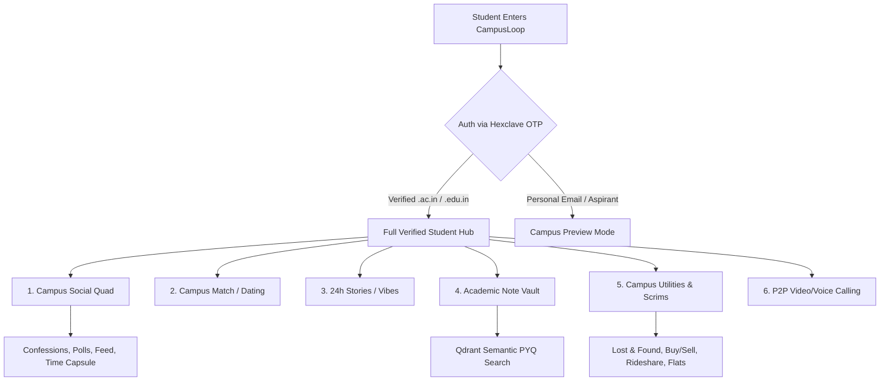
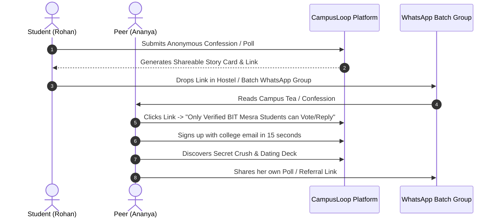
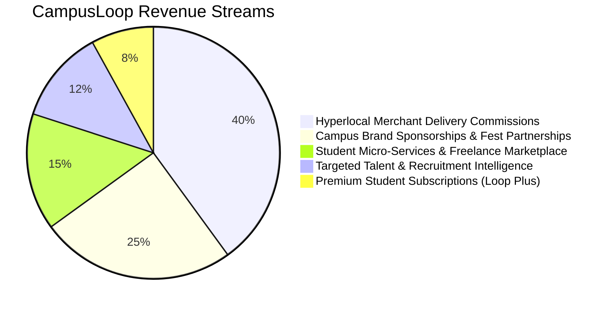

# 🎓 CampusLoop — Master Project Brief & Viral Growth Blueprint

> **"The Verified Digital Nervous System for 1,350+ Higher Education Campuses in India."**

---

## 📑 Table of Contents
1. [Executive Summary & Core Vision](#-1-executive-summary--core-vision)
2. [The Problem: Why Legacy Social Media Fails College Students](#-2-the-problem-why-legacy-social-media-fails-college-students)
3. [The Solution: Hyperlocal, Verified, Safe & Multi-Modal](#-3-the-solution-hyperlocal-verified-safe--multi-modal)
4. [Master Feature Matrix & Capabilities](#-4-master-feature-matrix--capabilities)
   - [4.1 Verified Identity & Campus Switcher](#41-verified-identity--campus-switcher)
   - [4.2 Campus Feed & Discussions](#42-campus-feed--discussions)
   - [4.3 Campus Match & Dating Deck](#43-campus-match--dating-deck)
   - [4.4 24-Hour Ephemeral Stories (Vibes)](#44-24-hour-ephemeral-stories-vibes)
   - [4.5 Real-Time Messenger & P2P WebRTC Calling](#45-real-time-messenger--p2p-webrtc-calling)
   - [4.6 The 7 Hyperlocal Campus Utility Portals](#46-the-7-hyperlocal-campus-utility-portals)
   - [4.7 Convocation Time Capsule & Batch Legacy Vault](#47-convocation-time-capsule--batch-legacy-vault)
   - [4.8 Clout, Gamification & Loop Points (LP)](#48-clout-gamification--loop-points-lp)
5. [🔥 The Viral Growth Engine & Playbook (How CampusLoop Goes Viral)](#-5-the-viral-growth-engine--playbook)
   - [Viral Loop #1: The "Secret Crush" & Dating Deck Reveal](#viral-loop-1-the-secret-crush--dating-deck-reveal)
   - [Viral Loop #2: The Midnight Canteen & Hostel Confessions War](#viral-loop-2-the-midnight-canteen--hostel-confessions-war)
   - [Viral Loop #3: The Exam Night PYQ Emergency Vault](#viral-loop-3-the-exam-night-pyq-emergency-vault)
   - [Viral Loop #4: The Convocation Batch Time Capsule](#viral-loop-4-the-convocation-batch-time-capsule)
   - [Viral Loop #5: The Loop Points (LP) & Blue Tick Status Game](#viral-loop-5-the-loop-points-lp--blue-tick-status-game)
   - [Viral Loop #6: Inter-College Campus Wars (IIT vs NIT vs BITS)](#viral-loop-6-inter-college-campus-wars)
   - [The 48-Hour Campus Takeover Playbook](#the-48-hour-campus-takeover-playbook)
6. [Technical Architecture & Invariants](#-6-technical-architecture--invariants)
7. [Trust, Safety, Moderation & Legal Compliance](#-7-trust-safety-moderation--legal-compliance)
8. [Public Investor & Tester Demo Access](#-8-public-investor--tester-demo-access)
9. [Business Model & Monetization Roadmap](#-9-business-model--monetization-roadmap)

---

## 🏛️ 1. Executive Summary & Core Vision

**CampusLoop** is a unified, verified, student-only social and utility operating system designed for India's **40+ million college students** across **1,350+ universities and institutes**.

Unlike broad-spectrum social platforms (Instagram, Twitter, Reddit, LinkedIn), CampusLoop provides an **exclusive institutional boundary**: students authenticate via their official university email (`.ac.in` / `.edu.in`), instantly unlocking their college's dedicated digital campus hub while retaining the option to participate in global cross-campus communities.

### 🌟 Key Highlights:
- **1,351 Pre-Indexed Indian Higher Education Campuses** across all 28 states and 8 union territories.
- **Multi-Modal Platform**: Combines social feeds, anonymous confessions, swipe dating, 24h stories, P2P calling, academic vaults, ridesharing, flatmate discovery, and campus marketplaces into one lightweight progressive web application.
- **Zero-Compromise Safety Architecture**: Real-time automated PII shields (doxxing firewall, harassment screening) preserving peer anonymity while upholding statutory compliance (DPDP Act 2023, UGC Anti-Ragging Rules, IT Rules 2021).
- **Gamified Loop Economy**: Loop Points (LP) reward engagement, unlocks verified blue badges, and drives exponential referral loops.

---

## 💔 2. The Problem: Why Legacy Social Media Fails College Students

| Platform | Why It Fails College Students |
| :--- | :--- |
| **Instagram** | **Broadcast & Performance Pressure**: Hyper-curated, anxiety-inducing aesthetics. No anonymity, no dedicated campus utility, flooded with external ads and reels. |
| **WhatsApp / Telegram** | **Chat Chaos & No Discovery**: Endless unindexed group chats (1,024 members cap), flooded with spam, PDFs lost in history, zero organic discovery. |
| **Reddit** | **Detached & Non-Hyperlocal**: College subreddits are either inactive, unverified (outsiders/trolls post freely), or lack student utilities (dating, rideshare, notes). |
| **LinkedIn** | **Corporate Cringe & Formality**: Imposter syndrome-heavy, strictly professional; impossible to discuss hostel food, canteen debates, or find dating partners. |
| **Tinder / Bumble** | **Unsafe & Flooded with Strangers**: No college email verification, rampant catfishing, awkward encounters with non-students outside campus culture. |

---

## 🚀 3. The Solution: Hyperlocal, Verified, Safe & Multi-Modal

CampusLoop solves this fragmentation by building a **walled-garden digital quad** for each university:



---

## 📦 4. Master Feature Matrix & Capabilities

### 4.1 Verified Identity & Campus Switcher
- **Institutional Email Gate**: Strict OTP domain verification (`@iitd.ac.in`, `@bitmesra.ac.in`, `@bits-pilani.ac.in`).
- **Campus Radius vs Global Feed**: 1-click switcher between **My Campus Hub** (hyperlocal) and **All India Global Feed** (1,351 colleges).
- **Public Vanity Profile URL**: Universal accessibility via `/@username` displaying student branch, clout rank, verified badges, and active stories.
- **Campus Preview Mode**: High school seniors, JEE/NEET aspirants, and guests sign up with personal emails to read confessions, fest chatter, and placement discussions from up to 5 dream campuses, with zero-friction in-place upgrades upon college admission.

### 4.2 Campus Feed & Discussions (`/app`)
- **5 Dynamic Feed Ranking Algorithms**:
  1. `for_you`: Personalized multi-factor ranking (campus affinity + mutual follow weight + recency decay).
  2. `latest`: Reverse chronological real-time stream.
  3. `trending`: Velocity-weighted upvotes + comments multiplier.
  4. `top_voted`: Lifetime highest karma posts.
  5. `discussed`: Highest comment engagement count.
- **Post Modalities**:
  - 💭 **Normal Posts**: Rich text, mentions, hashtags, and high-res image carousels.
  - 🕵️ **Anonymous Confessions**: Cryptographically hashed handles (`anon_e7f3`), bypassing social friction.
  - 📊 **Interactive Live Polls**: Real-time visual voting breakdown, live voter tallies, and expiration schedules.
  - ❓ **Questions & Advice**: Dedicated Q&A badge with verified answer upvoting.
- **Twitter-Style 1-Tap & Quoted Reposts**: Interactive modal with quote composer and synthesized Web Audio celebration chime.
- **Anonymity Mode Filter Switcher**: 1-click toggle between **All Posts (🎭 Anon Enabled)** and **Public Only (🛡️ No Anon)** with zero-reload timeline filtering.

### 4.3 Campus Match & Dating Deck (`/app/dating`)
- **Framer Motion Draggable Swipe Deck**: Physics-based drag card stack with velocity release detection (`velocity.x > 400 || offset.x > 80`).
- **Verified Student Portrait Cards**: High-definition verified student profiles with branch, graduation year, bio prompts, and compatibility scores.
- **Zero-Lag Image Preloading Engine**: Pre-caches the next 5 student candidate photos in browser memory.
- **Secret Crush & Mutual Match Engine**: Declare up to 3 secret crushes from your college; if they add you back, an instant mutual match screen triggers with confetti and direct chat initiation.
- **Radius & Gender Filters**: Filter by gender preferences and campus radius (Same Campus vs. Cross-College).

### 4.4 24-Hour Ephemeral Stories (Vibes) (`/app/stories/new`)
- **Fullscreen Interactive Story Viewer**: Progressive timer bars (5s duration), tap left/right to skip, tap-and-hold to pause, and instant DM reply.
- **Story Creator Studio**: Dynamic gradient backgrounds, typography modifiers, Gen-Z campus stickers, and photo uploads.
- **Heart Reactions & Story Analytics**: Real-time view counts, unique viewer avatar stacks, and instant notification triggers.

### 4.5 Real-Time Messenger & P2P WebRTC Calling (`/chat` & `/calls`)
- **Direct 1-on-1 & Group Messaging**: Instant messaging, photo sharing, typing indicators, and unread badges.
- **Group Channels**: Interest cohorts ("🚀 HackBIT 2026 Team", "Hostel 3 Mess Committee").
- **Direct P2P WebRTC Calling**: Encrypted browser-to-browser voice and video calling powered by PeerJS with control plane verification in PostgreSQL (`call_sessions`). Zero media data ever touches intermediate servers.

### 4.6 The 7 Hyperlocal Campus Utility Portals
1. **🔎 Lost & Found (`/app/lost-and-found`)**: Post lost AirPods, IDs, or keys; claim with photographic proof via direct chat.
2. **🛒 Campus Marketplace (`/app/marketplace`)**: Buy and sell hostel gear (bicycles, induction stoves, coolers, lab coats, textbooks) directly with peers.
3. **🚗 Rideshare & Cab Pooling (`/app/rideshare`)**: Split airport and railway station cabs during semester breaks and weekends.
4. **🏠 Housing & Flatmates (`/app/housing`)**: Off-campus 2BHK/3BHK listings, flatmate roommate discovery with lifestyle filters (veg/non-veg, night owl/early bird).
5. **🎮 Gaming Scrims Arena (`/app/gaming`)**: 5v5 Valorant lobbies, BGMI custom rooms, and FIFA tournament recruitments.
6. **📚 Academics, Notes & PYQs (`/app/academics`)**: Exam-night formula sheets, handwritten lecture notes, and solved past-year questions indexed by subject code.
7. **🏫 1,350+ Indexed College Hubs (`/app/colleges`)**: Full searchable index of engineering, medical, law, and commerce institutions with 1-click domain whitelist requests.

### 4.7 Convocation Time Capsule & Batch Legacy Vault (`/app/capsule`)
- **Sealed Batch Letters & Predictions**: Write cryptographically sealed letters and placement/startup predictions locked until graduation day.
- **Live Graduation Countdown Ticker**: Days, hours, and minutes countdown to the batch convocation ceremony.
- **Public Museum Wall**: Upon unlock, all letters are rendered onto an interactive retrospective gallery.

### 4.8 Clout, Gamification & Loop Points (LP)
- **Earn Loop Points (LP)**:
  - Inviting a verified college peer: **+20 LP**
  - Publishing an engaging post: **+5 LP**
  - Replying with an insightful comment: **+2 LP**
  - Upvoting or voting on a poll: **+1 LP**
- **4 Clout Ranks**:
  1. **Bronze Rookie** (0–49 LP)
  2. **Silver Achiever** (50–149 LP)
  3. **Gold Star** (150–299 LP) — **Automatically unlocks the Blue Tick Verified Badge ⚡**
  4. **Platinum Legend** (300+ LP) — Priority algorithm boost in the feed and dating deck.

---

## 🔥 5. The Viral Growth Engine & Playbook

CampusLoop's growth model relies on **hyperlocal k-factor loops** where one user's action naturally compels 5–10 peers in their immediate hostel, branch, or canteen circle to sign up.



---

### Viral Loop #1: The "Secret Crush" & Dating Deck Reveal
- **Mechanic**: A student selects a classmate or crush on the dating interface.
- **Viral Trigger**: The recipient receives an anonymous notification: *"Someone from your branch (CSE 3rd Year) just added you to their Secret Crush list on CampusLoop. Sign in with your college email to check mutual matches."*
- **Result**: Irresistible curiosity drives instant signups across entire hostel blocks.

### Viral Loop #2: The Midnight Canteen & Hostel Confessions War
- **Mechanic**: Live polls comparing campus essentials: *"Which canteen has the worst hygiene: IC or C3?"* or *"Who was playing speaker at 3 AM in Hostel 7?"*
- **Viral Trigger**: Polls allow 1-tap sharing to Instagram Stories with a branded gradient summary sticker.
- **Result**: Sparks intense debates in WhatsApp batch groups, pulling 200+ students into the live voting poll in under 30 minutes.

### Viral Loop #3: The Exam Night PYQ Emergency Vault
- **Mechanic**: 48 hours before mid-term or end-term exams, top students or Class Representatives (CR) upload handwritten notes and solved PYQs to `/app/academics`.
- **Viral Trigger**: *"End-Sem Data Structures PYQ Solutions with Professor notes uploaded on CampusLoop Academics."*
- **Result**: 80%+ of an entire engineering branch registers in a single night to download and view the notes.

### Viral Loop #4: The Convocation Batch Time Capsule
- **Mechanic**: First-year or final-year students write letters and predictions: *"Predicting who gets placed at Google and who gets married first."*
- **Viral Trigger**: The time capsule generates a digital batch sealing certificate shared on LinkedIn and Instagram.
- **Result**: Creates a permanent nostalgic tie that brings entire alumni batches back together upon convocation unlock.

### Viral Loop #5: The Loop Points (LP) & Blue Tick Status Game
- **Mechanic**: Blue tick verification is not paid; it is strictly earned at **150 Loop Points** (via invites and high-quality posts).
- **Viral Trigger**: Students want the clout badge next to their anonymous and public handles, driving them to share their personal referral link (`/join?ref=username`) across college Discord and WhatsApp servers.

### Viral Loop #6: Inter-College Campus Wars
- **Mechanic**: Cross-campus hackathon leaderboards, meme battles, and sports fest chatter under `/app/discover`.
- **Viral Trigger**: *"IIT Delhi vs BITS Pilani Hackathon Face-Off — Vote for your campus representative."*
- **Result**: National inter-college pride ignites cross-campus viral sharing.

---

### 📋 The 48-Hour Campus Takeover Playbook
*How CampusLoop captures 1,000+ verified students in a new college within 48 hours:*

```
[HOUR 0-6]   Deploy 2 Campus Ambassadors in the target college.
             - Seed 10 trending confessions, 2 canteen polls, and 5 academic notes.

[HOUR 6-18]  Drop the "Campus Tea & Canteen Poll" into the 3 largest hostel WhatsApp groups.
             - Initial 150 early-adopters onboard to vote and see poll results.

[HOUR 18-30] Trigger the "Secret Crush" loop.
             - Students explore the Dating Deck, adding campus crushes.
             - Ambient word-of-mouth spreads across dining halls and canteens.

[HOUR 30-42] Academic Vault Activation.
             - CR shares midterm question banks exclusively on CampusLoop.

[HOUR 42-48] Clout Threshold Reached (1,000+ Verified Students).
             - The college hub achieves self-sustaining daily organic activity.
```

---

## 🛠️ 6. Technical Architecture & Invariants

```
src/
├── app/                       # Next.js 16 App Router
│   ├── (main)/                # Main feed, profiles, hubs, communities
│   ├── (dating)/              # Standalone dating deck (/app/dating)
│   ├── (academics)/           # Dedicated academic resource browser & PDF viewer
│   ├── demo/                  # Public demo credential portal
│   ├── api/                   # REST endpoints (feed, chat, dating, stories, search)
│   └── admin/                 # Content moderation dashboard
├── components/                # Modular UI primitives (Tailwind CSS + Lucide Icons)
│   ├── feed/                  # Feed cards, repost modals, poll visualizer
│   ├── dating/                # Framer Motion card stack, filters modal
│   ├── stories/               # Story player, sticker composer
│   └── academics/             # Academic card, preview modals
├── db/                        # Neon Serverless PostgreSQL + Drizzle ORM
│   ├── schema/                # Partitioned tables (users, posts, chat, dating, events)
│   └── schema.ts              # Master Drizzle barrel
├── lib/                       # Utilities, Auth, Gamification
│   ├── qdrant/                # Qdrant Cloud Vector client & semantic embeddings
│   ├── calls/                 # PeerJS WebRTC call engine
│   └── demo-credentials.ts    # Official demo configuration
```

### ⚡ Critical Engineering Invariants:
1. **Zero-Downtime Qdrant Fallback**: Qdrant Vector DB powers semantic related post search and dating compatibility with a strict 600ms circuit breaker. If Qdrant is unavailable, the application seamlessly falls back to PostgreSQL relational queries with 0ms interruption.
2. **P2P Audio/Video Isolation**: WebRTC media streams connect directly peer-to-peer. The backend worker only handles signaling and session authorization in `call_sessions`.
3. **Optimistic UI Updates**: Likes, bookmarks, votes, and comments mutate local state immediately with rollback on network failure.
4. **Offline Sensory Synthesis**: Micro-interaction sounds (`ting`, `pop`, `chime`) are synthesized on-the-fly via Web Audio API without fetching MP3 assets over the network.

---

## 🛡️ 7. Trust, Safety, Moderation & Legal Compliance

- **Statutory Compliance**:
  - **DPDP Act 2023**: Strict data minimization; author identities are hashed and isolated in secure database vaults.
  - **IT Rules 2021**: Real-time content reporting, 3-strike quarantine escrow, and designated Grievance Officer workflows.
  - **UGC Anti-Ragging Regulations 2009**: Zero tolerance for ragging, harassment, or intimidation.
- **Automated PII & Harassment Firewall**:
  - Real-time client & server scanning for phone numbers, email addresses, roll numbers, and named branch accusations.
  - Generates an Anonymity Vault Token (`anon_xxxx`) while blocking malicious doxxing attempts before database insertion.

---

## 🔑 8. Public Investor & Tester Demo Access

For investors, evaluators, and users testing without an Indian `.ac.in` college email:

| Attribute | Value |
| :--- | :--- |
| **Demo Email** | `demo@campusloop.space` |
| **Demo Password** | `CampusLoop@2026!` |
| **Demo Username** | `@demo_tester` |
| **Clout Status** | **450 LP (Gold Star / Blue Tick Verified ⚡)** |
| **Assigned Hub** | Birla Institute of Technology, Mesra (`bitmesra`) |
| **Public Demo Hub** | [`https://campusloop.space/demo`](https://campusloop.space/demo) |
| **Referral Link** | [`https://campusloop.space/join?ref=demo_tester`](https://campusloop.space/join?ref=demo_tester) |

*Pre-seeded with active peer friendships, 4 chat threads, 8 real-time notifications, campus confessions, live polls, dating swipe matches, academic notes, and 10+ campus utility hub listings.*

---

## 💰 9. Business Model & Monetization Roadmap



1. **Hyperlocal Campus Delivery & Canteen Commissions (40%)**:
   - Integrated delivery portal for night canteens, stationery stores, and local food joints operating inside/around campus boundaries.
2. **Campus Brand Sponsorships & Fest Partnerships (25%)**:
   - Direct sponsorship access to college fests, hackathons, and brand activations (Red Bull, tech startups, fintech apps) targeted by college tier.
3. **Student Micro-Services & Skill Marketplace (15%)**:
   - Escrow fees on peer tutoring, resume reviews, graphic design, and coding freelance gigs between verified students.
4. **Targeted Talent & Campus Placement Intelligence (12%)**:
   - B2B recruitment dashboard allowing tech companies to discover top-ranked coders, designers, and campus hackathon winners directly by university.
5. **Loop Plus Premium Subscriptions (8%)**:
   - Premium perks: unlimited dating swipe rollbacks, profile customization themes, and advanced academic search filters.

---

## 🏁 10. Summary & Next Milestones

CampusLoop is uniquely positioned at the intersection of **identity verification**, **hyperlocal utility**, and **campus culture**. By replacing fragmented, generic platforms with a purpose-built digital university ecosystem, CampusLoop is set to become the definitive daily habit for millions of college students.

*Document Version: 2.4.0 — Maintained by CampusLoop Core Team.*
