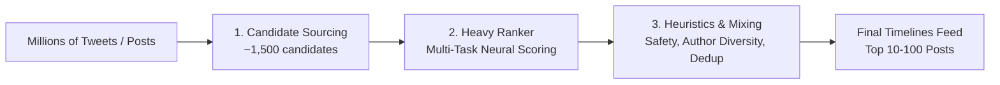

# 🧠 Social Recommendation Algorithms: Architecture & Mechanics Under the Hood
*A Deep Dive into Twitter/X's Open-Sourced Recommendation Engine, SimClusters, Heavy Ranker, ATProto/Bluesky, and Architectural Blueprints for CampusLoop.*

---

## 📌 Executive Summary

Modern social feed ranking algorithms have evolved from simple chronological streams into sophisticated multi-stage machine learning pipelines designed to distill **hundreds of millions of candidates down to the top 100-1,500 most relevant posts** in under **150 milliseconds**.

This document breaks down:
1. **Twitter/X Recommendation Engine (`the-algorithm`)**
2. **Candidate Generation Pipelines (In-Network vs Out-of-Network)**
3. **Graph Embeddings & Community Detection (SimClusters & TwHIN)**
4. **The Heavy Ranker Multi-Task Scoring Engine**
5. **Bluesky / AT Protocol Algorithmic Decentralization**
6. **CampusLoop Architectural Adaptation Blueprint**

---

## 🏗️ 1. High-Level Recommendation Pipeline

The feed generation cycle executes in **three sequential stages**:

1. **Candidate Sourcing (~1,500 posts)**:
   - **50% In-Network**: Posts from users you explicitly follow (GraphJet / RealGraph).
   - **50% Out-of-Network**: Discovery posts from users outside your immediate network (SimClusters, TwHIN, Topic Search).
2. **Heavy Ranker (Multi-Task Scoring)**:
   - Scores each candidate against ~10 predicted user interaction probabilities ($P(\text{like})$, $P(\text{reply})$, $P(\text{retweet})$, $P(\text{dwell time})$, $P(\text{report})$).
3. **Heuristics, Safety, & Home Mixer**:
   - Applies author diversity limits (e.g. no 3 consecutive posts from the same person), block/mute lists, NSFW safety rules, and injects ads/trending topics.

---

## 🔬 2. Candidate Sourcing Mechanics

### A. In-Network Candidate Generation
* **GraphJet (In-Memory Graph Engine)**:
  - Maintains real-time bipartite graphs of users and tweets.
  - Computes immediate engagement velocity (likes, retweets in the last $N$ minutes) among followed accounts.
* **RealGraph**:
  - A machine learning model predicting the likelihood of direct interaction between User $A$ and User $B$ based on past DMs, mentions, retweets, and mutual follows.

### B. Out-of-Network Candidate Generation
* **SimClusters (Community Detection via Matrix Factorization)**:
  - Groups users into **~145,000 overlapping interest communities** (e.g. *Silicon Valley Tech, Indian Engineering Colleges, Anime, Sports*).
  - Every user and every post has a sparse vector representing affinity scores across these clusters:
    $$\text{Affinity}(U, C) = \sum_{a \in \text{Followed}(U)} \text{ClusterWeight}(a, C)$$
  - If users in your active cluster are heavily liking a new post, that post is surfaced to your candidate pool even if you don't follow the author.
* **TwHIN (Twitter Heterogeneous Information Network Embeddings)**:
  - Generates dense vector embeddings (e.g., 200–512 dimensional vectors) across heterogeneous nodes: **Users, Tweets, Communities, Domains, Hashtags**.
  - Trained using multi-task graph contrastive learning across billions of graph edges.
  - Allows instant nearest-neighbor ($k\text{-NN}$) lookup for semantic relevance.

---

## ⚡ 3. The Heavy Ranker: Multi-Task Scoring Model

The Heavy Ranker evaluates thousands of candidate features including:
- **User Features**: Historical engagement rate, active hours, follower count, clout tier.
- **Post Features**: Media type (photo, video, poll, text), age in seconds, token embeddings, hashtag context.
- **Interaction Graph**: Similarity between user vector and post embedding vector.

### The Scoring Equation
The final score $S$ for a candidate post is computed as a weighted combination of engagement probabilities:

$$S = w_{\text{like}} \cdot P(\text{like}) + w_{\text{retweet}} \cdot P(\text{retweet}) + w_{\text{reply}} \cdot P(\text{reply}) + w_{\text{quote}} \cdot P(\text{quote}) + w_{\text{dwell}} \cdot P(\text{dwell} > 2\text{min}) - w_{\text{neg}} \cdot P(\text{not\_interested})$$

| Interaction Metric | Description | Typical Relative Weight |
| :--- | :--- | :--- |
| **$P(\text{reply})$** | Author-to-user conversation/reply | **High (27x)** |
| **$P(\text{retweet})$ / Quote** | Virality & network distribution | **High (1x – 20x)** |
| **$P(\text{like})$** | Positive passive sentiment | **Baseline (0.5x – 1x)** |
| **$P(\text{dwell})$** | Time spent reading long-form/discussion | **Medium (10x)** |
| **$P(\text{report} / \text{mute})$** | Negative feedback & spam signals | **Heavy Penalty (-74x)** |

---

## 🌐 4. Bluesky & AT Protocol: Custom Feed Generators

While Twitter uses centralized heavy rankers, **Bluesky's AT Protocol (ATProto)** introduces open, decentralized feed algorithms:
* **Skeleton Feeds**: Feed Generator microservices return a lightweight list of post DIDs (`at://did:plc:.../app.bsky.feed.post/...`).
* **AppView Hydration**: The central AppView service hydrates these skeletons with user profiles, like counts, and images.
* **Algorithmic Marketplace**: Users can subscribe to arbitrary feed algorithms (e.g. *Only Engineering, Discover Campus, High-Karma Discussions*) without platform lock-in.

---

## 🎓 5. Implementation Blueprint for CampusLoop

For **CampusLoop**, we combine Twitter's **SimClusters / Heavy Ranker concepts** with university-specific signals:

### A. Campus-Radius & Branch Similarity Matrix
1. **In-Campus Signals**:
   - Posts from the student's own verified institution get a $1.8\times$ baseline boost when viewing the "Campus" or "Personalized" tab.
2. **Branch / Discipline SimClusters**:
   - Group students by Academic Discipline (e.g. *Computer Science, MBBS/Medicine, MBA/Commerce, Architecture*).
   - Upvotes and comments from students in the same branch boost relevance for peers across all colleges in India.

### B. CampusLoop Ranking Formula ($R_{\text{post}}$)

$$R_{\text{post}} = \frac{V_{\text{upvotes}} \cdot 1.5 + C_{\text{comments}} \cdot 3.0 + P_{\text{poll\_votes}} \cdot 2.0 + L_{\text{clout\_tier}}}{(T_{\text{hours}} + 2)^{1.4}} \times \text{CampusMultiplier}$$

Where:
- $\text{CampusMultiplier} = 2.0$ for user's home campus, $1.0$ for global.
- $L_{\text{clout\_tier}} = 1.0 + \frac{\text{Author LP}}{1000}$ (Rewards high-reputation contributors).
- $(T_{\text{hours}} + 2)^{1.4}$ provides smooth exponential time decay (Hacker News gravity style).

### C. Semantic Vector Search & Dense Embeddings (Qdrant Cloud)

In addition to relational gravity formulas, CampusLoop executes dense semantic vector similarity matching via **Qdrant Vector DB** (`src/lib/qdrant/`):
- **Embedding Space**: 384-dimensional dense vectors generated via normalized sub-word and n-gram hash projection (`src/lib/qdrant/embeddings.ts`).
- **Cosine Similarity Threshold**: Top nearest neighbor candidates evaluated with score threshold $\ge 0.10$.
- **Zero-Downtime Fallback Layer**: If vector cloud experiences latency exceeding 600ms or network failure, queries seamlessly revert 100% to PostgreSQL relational indices with zero downtime.

---

## 🚀 6. Summary Comparison Table

| Architecture Dimension | Twitter / X (`the-algorithm`) | Bluesky (ATProto) | CampusLoop Architecture |
| :--- | :--- | :--- | :--- |
| **Candidate Retrieval** | GraphJet + SimClusters (145k clusters) | Custom Federated Feed Generators | **Qdrant Dense Vectors (384-dim)** + Drizzle ORM Scope/Branch Indices |
| **Scoring Engine** | Multi-Task Neural Ranker (10+ predictions) | Custom Serverless Queries | Time-Decayed Engagement Weighting + Cosine Vector Similarity |
| **Identity Verification** | Paid Blue Check ($8/mo) | Domain Verification (DNS/TXT) | **Strict Verified College Email Whitelist** |
| **Privacy & Safety** | Shadowbanning / Visibility Filters | Blocklists & Moderation Labelers | **AES-Sealed Cryptographic Anon Identity Vault** |
| **Feed Orchestration** | Java/Scala Home Mixer & Rust rewrites | AppView Skeletons | Next.js 16 App Router on Cloudflare Workers |

---
*Created for CampusLoop Engineering & AI Research — 2026.*
